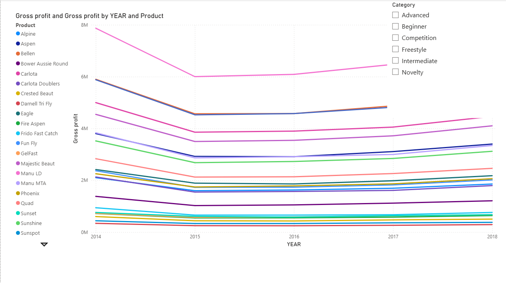
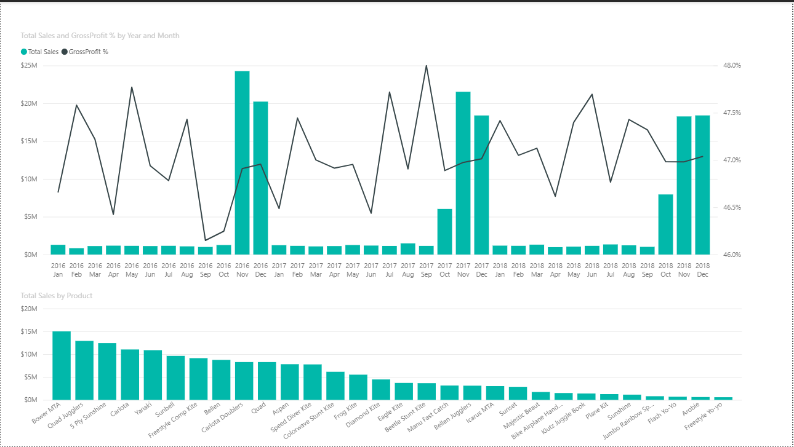

Power BI Sales Dashboard

Project Overview

This project demonstrates the use of Microsoft Power BI to transform raw business data into interactive dashboards and actionable insights. The dashboards provide sales analysis, profitability trends, product performance evaluation, and geographical business insights.

Tools Used

* Microsoft Power BI
* Power Query
* DAX (Data Analysis Expressions)
* Data Modeling
* Interactive Dashboards

Project Files

Sales analysis.pbix

* Sales performance dashboard
* Revenue and profitability analysis
* Product performance insights
* Geographic sales analysis

Analysis.pbix

* Business data exploration
* Trend analysis
* Interactive visualizations
* KPI reporting

Dashboard Features

* Interactive Filters and Slicers
* Sales Trend Analysis
* Gross Profit Analysis
* Product Performance Evaluation
* Geographic Business Insights
* KPI Monitoring
* Dynamic Visualizations

Skills Demonstrated

* Data Cleaning
* Data Transformation
* Data Modeling
* Data Visualization
* Dashboard Development
* Business Intelligence
* KPI Reporting
* Analytical Thinking

Business Value

The dashboards help convert raw business data into meaningful insights, enabling better decision-making through visual analytics, performance tracking, and trend identification.

Author

Palak Manapure

Aspiring Data Analyst | Excel | SQL | Power BI | Python
